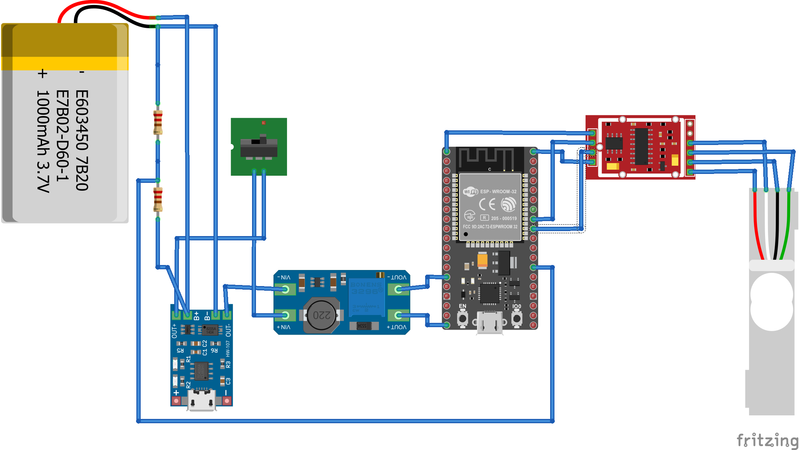

# DIY

You can assemble the device from pre-built modules. This build would be bulkier. It also would take fewer samples-per-second if the HX711 is left unmodified.

## Schematic

## BOM

### MCU

[ESP32](https://www.aliexpress.com/item/1005005704190069.html)

### Measurement

[HX711](https://www.aliexpress.com/item/1005004493775451.html)
[S-type strain gauge](https://www.aliexpress.com/item/32866914213.html).

### Power

[MT3808](https://www.aliexpress.com/item/1005005682216062.html)
[18650 battery](https://www.aliexpress.com/item/32821524948.html)
[TP4056 module](https://www.aliexpress.com/item/1005004427739715.html)

### other

[Switch SPST](https://www.aliexpress.com/item/4001165826718.html)

## Images

