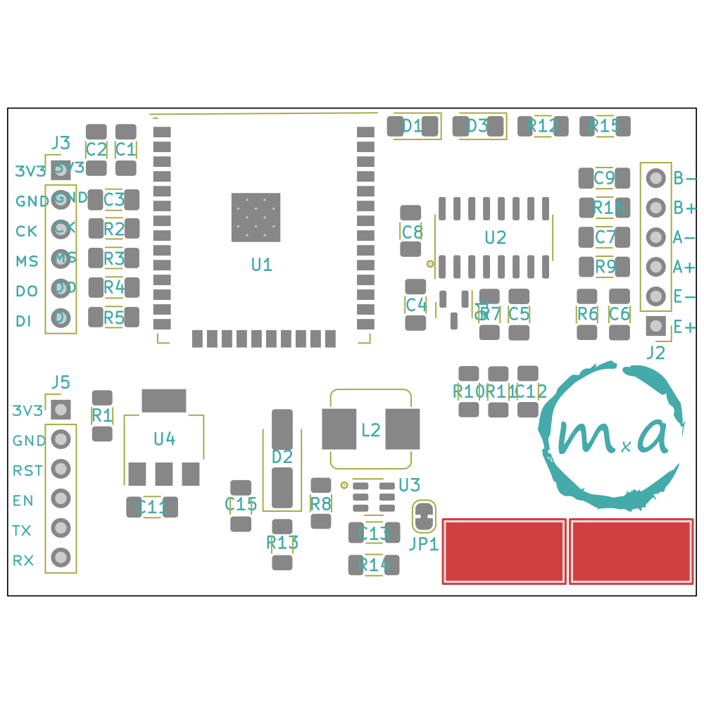

# Hardware

The hardware is based on [ESP32-WROOM module](https://www.aliexpress.com/item/32840441199.html), [HX711](https://www.aliexpress.com/item/1005004493775451.html) amplifier and [S-type strain gauge](https://www.aliexpress.com/item/32866914213.html).

The power is supplied by a single [18650 battery](https://www.aliexpress.com/item/32821524948.html) and a [TP4056 module](https://www.aliexpress.com/item/1005004427739715.html) for battery charging.

## Schematic

## PCB

### PCB v2 image

### Old PCB revisions

## HX711

Increasing HX711 sampling rate [youtube](https://www.youtube.com/watch?v=Rp_M0NbDSpo)

## BOM

null|Sourced|Value|Footprint|Quantity|
|---|-------|-----|---------|--------|
1|C1, C3, C5, C7, C9, C12|100nF|C_1206_3216Metric_Pad1.33x1.80mm_HandSolder|6
2|C2, C4, C6|10uF|C_1206_3216Metric_Pad1.33x1.80mm_HandSolder|3
3|C11, C13, C15|22uF|C_1206_3216Metric_Pad1.33x1.80mm_HandSolder|3
4|C8|22pF|C_1206_3216Metric_Pad1.33x1.80mm_HandSolder|1
5|R2, R3, R4, R5|100R|R_1206_3216Metric_Pad1.30x1.75mm_HandSolder|4
6|R1, R6, R14|10K|R_1206_3216Metric_Pad1.30x1.75mm_HandSolder|3
7|R9, R16|1K2|R_1206_3216Metric_Pad1.30x1.75mm_HandSolder|2
8|R12, R15|330R|R_1206_3216Metric_Pad1.30x1.75mm_HandSolder|2
9|R7|8K2|R_1206_3216Metric_Pad1.30x1.75mm_HandSolder|1
10|R8|110K|R_1206_3216Metric_Pad1.30x1.75mm_HandSolder|1
11|R10|1M|R_1206_3216Metric_Pad1.30x1.75mm_HandSolder|1
12|R11|330K|R_1206_3216Metric_Pad1.30x1.75mm_HandSolder|1
13|R13|15K|R_1206_3216Metric_Pad1.30x1.75mm_HandSolder|1
14|L2|22uH|L_Bourns_SRP7028A_7.3x6.6mm|1
15|D1, D3|LED|D_1206_3216Metric_Pad1.42x1.75mm_HandSolder|2
16|D2|SS34|D_SMA_Handsoldering|1
17|U1|ESP32-WROOM-32|ESP32-WROOM-32|1
18|U2|HX711|SOP-16_3.9x9.9mm_P1.27mm|1
19|U3|MT3608|SOT-23-6|1
20|U4|AMS1117-3.3|SOT-223-3_TabPin2|1
21|JP1|Jumper_2_Bridged|SolderJumper-2_P1.3mm_Bridged_RoundedPad1.0x1.5mm|1
22|Q1|S9015|SOT-23|1
23|J4, J6|Conn_01x01_Pin|SolderWirePad_1x01_SMD_5x10mm|2
24|J2|Conn_01x04_Pin|PinHeader_1x06_P2.54mm_Vertical|1
25|J3|JTAG|PinHeader_1x06_P2.54mm_Vertical|1
26|J5|UART|PinHeader_1x06_P2.54mm_Vertical|1

## Images

