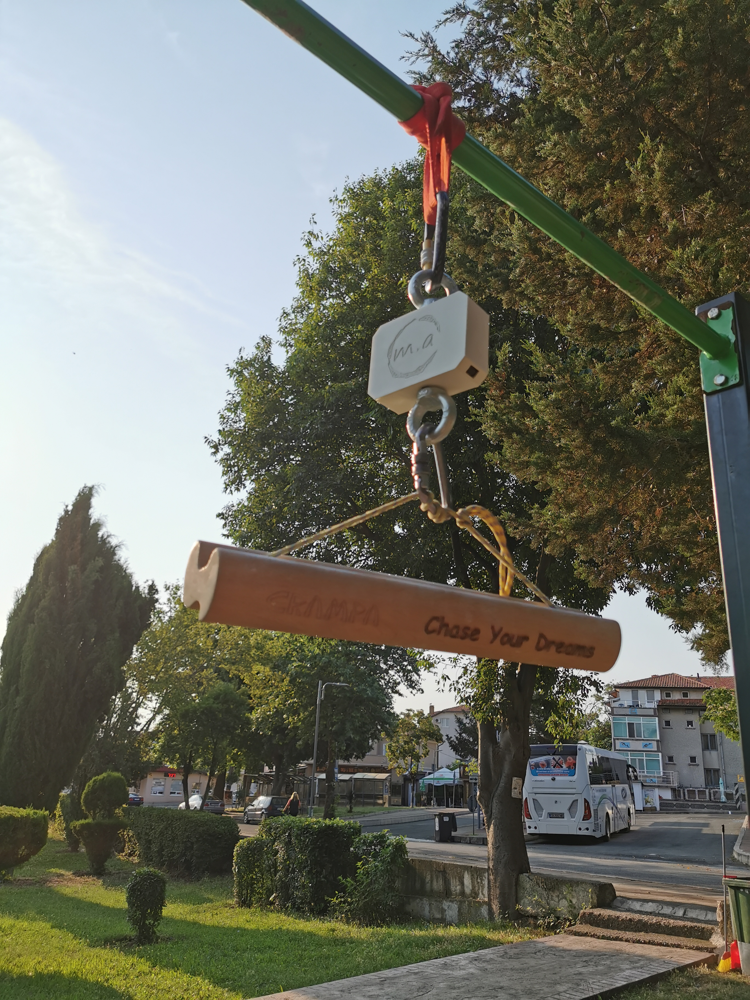
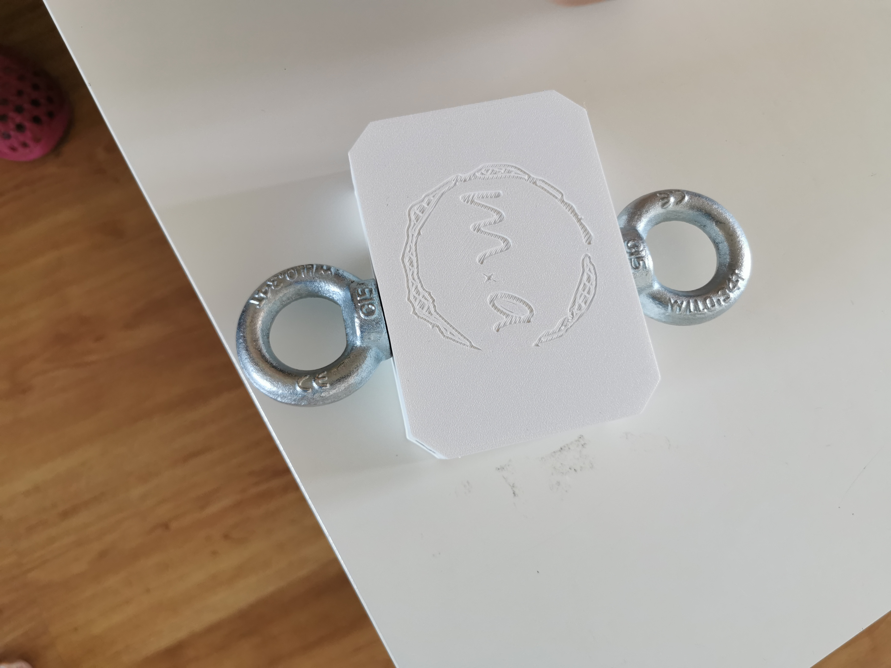
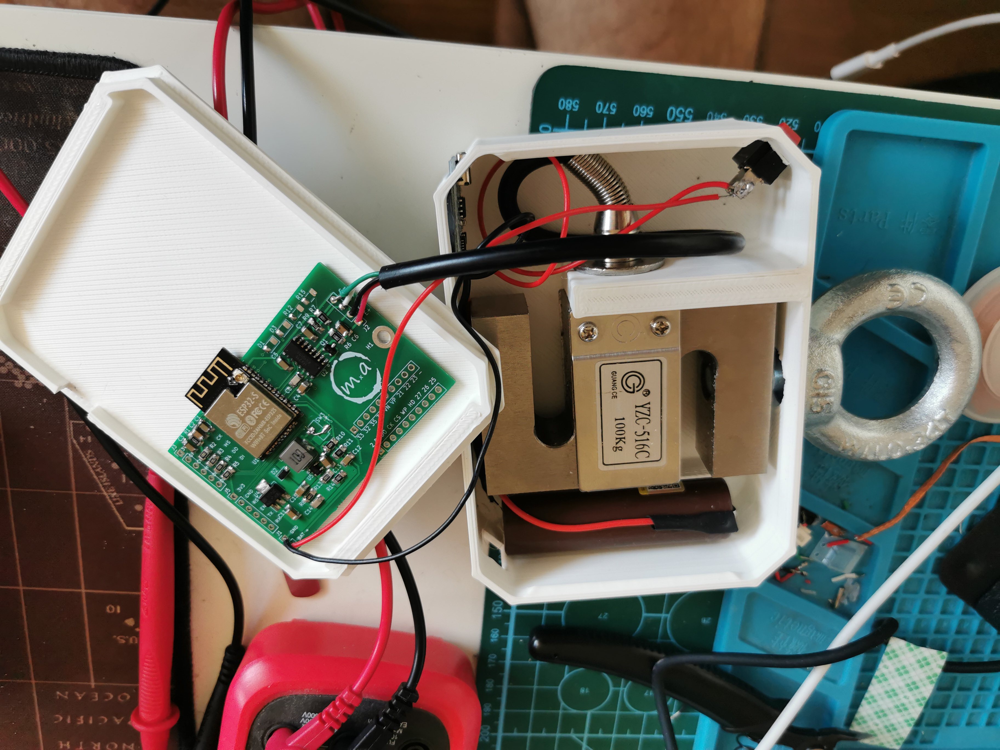
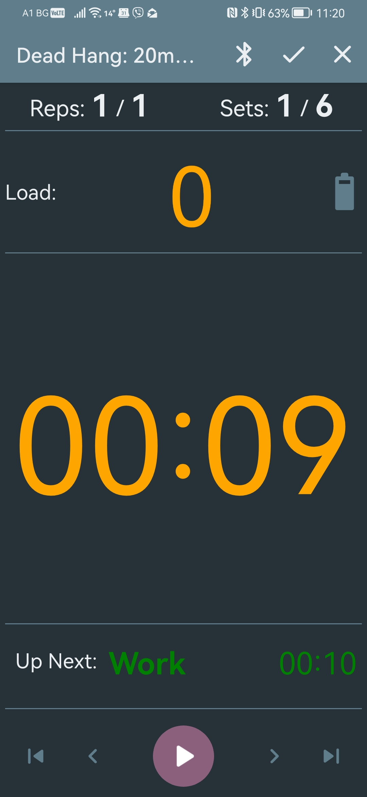
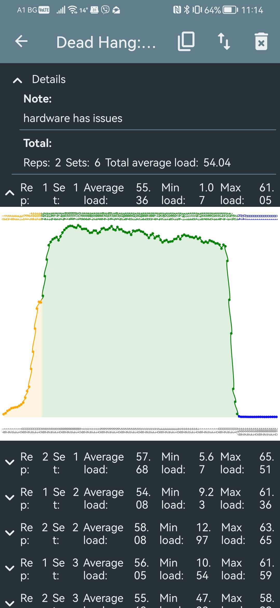

# MxA

<link rel="stylesheet" href="docs/docs.css" />

MxA is a portable BLE-enabled strain gauge that can be used for weight-free training as well as testing/assessment.

{.img}

## Hardware technical specification

*TBA*

{width:40px;}

[Read more...](hardware.md)

## Firmware

[Read more...](firmware.md)

## Mobile application

*TBA*

[Read more...](mobile-app.md)