# MxA

MxA is a portable BLE-enabled strain gauge that can be used for weight-free training as well as testing/assessment.

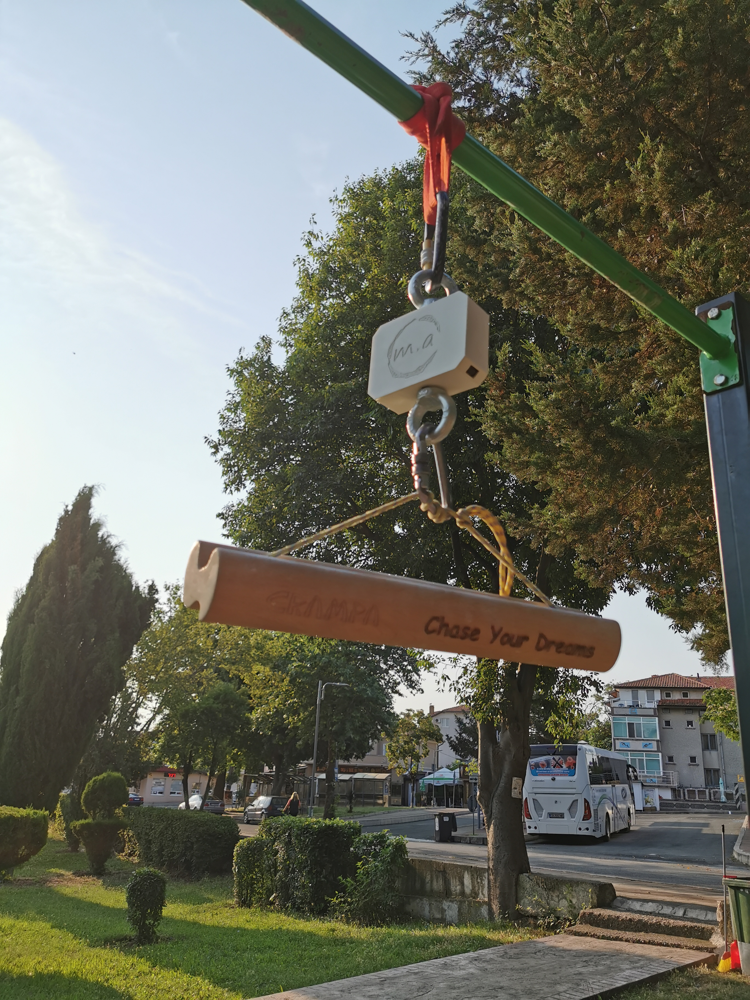

## Hardware technical specification

*TBA*

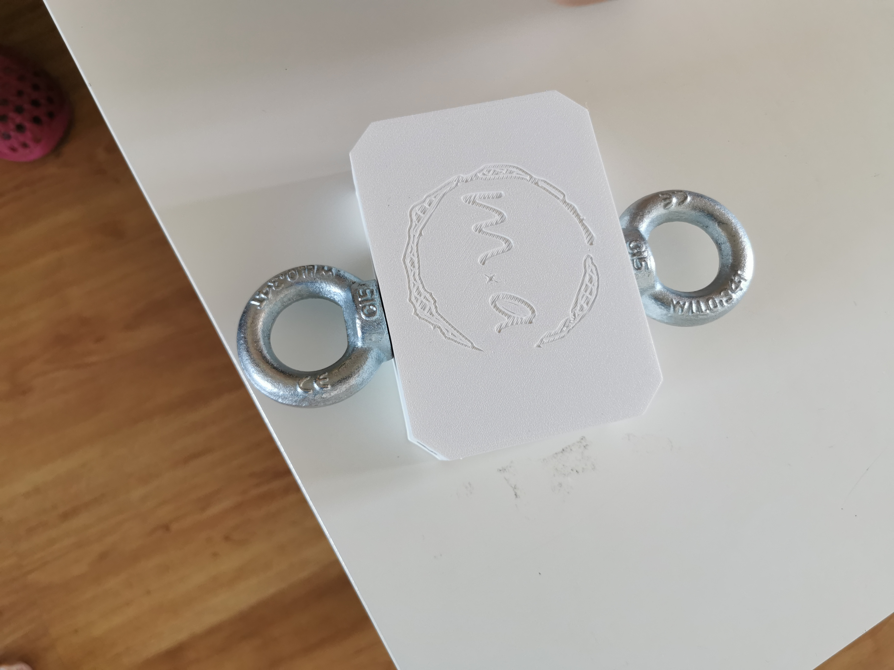
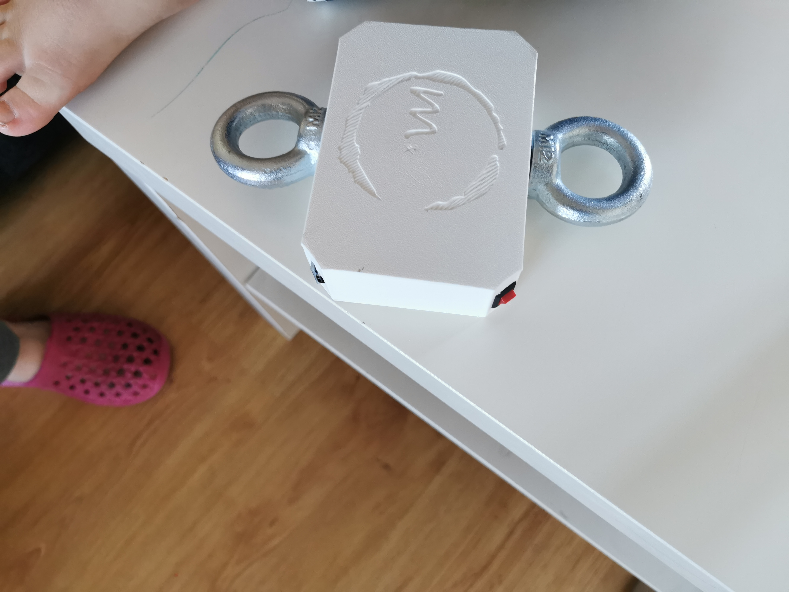
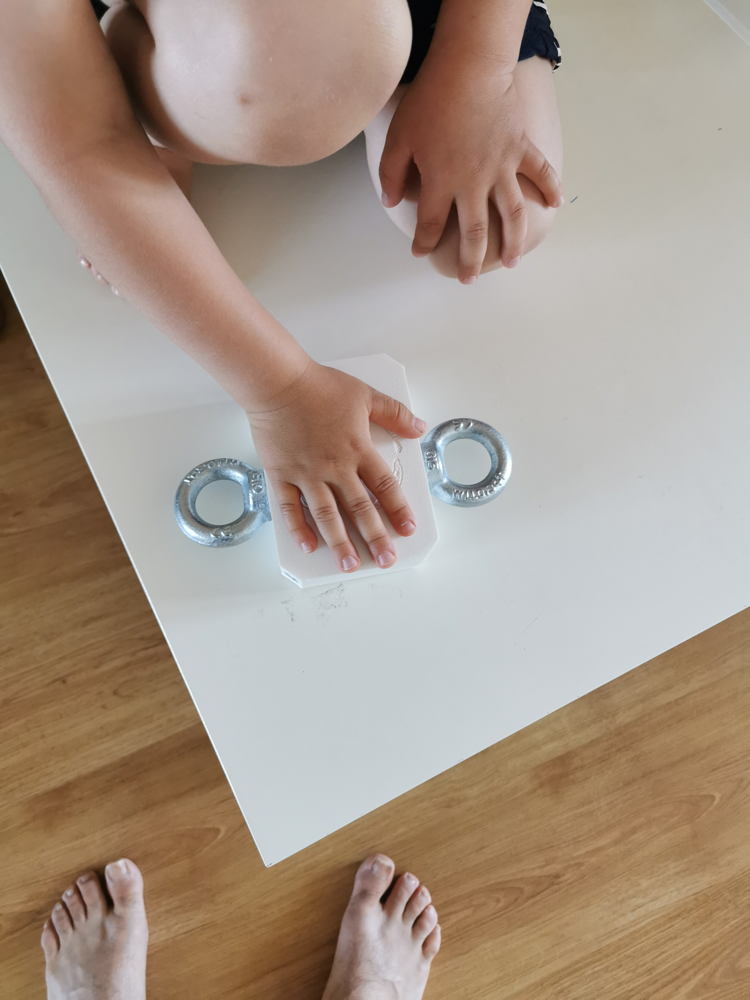
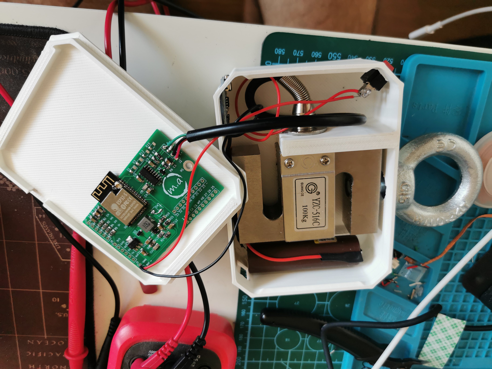
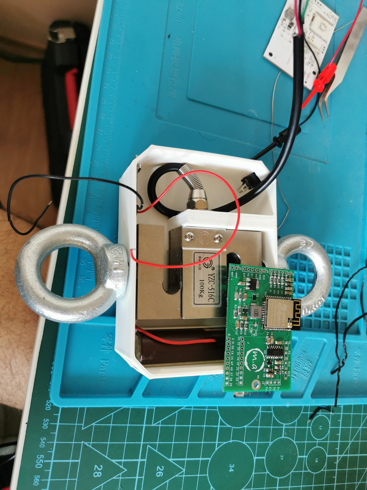
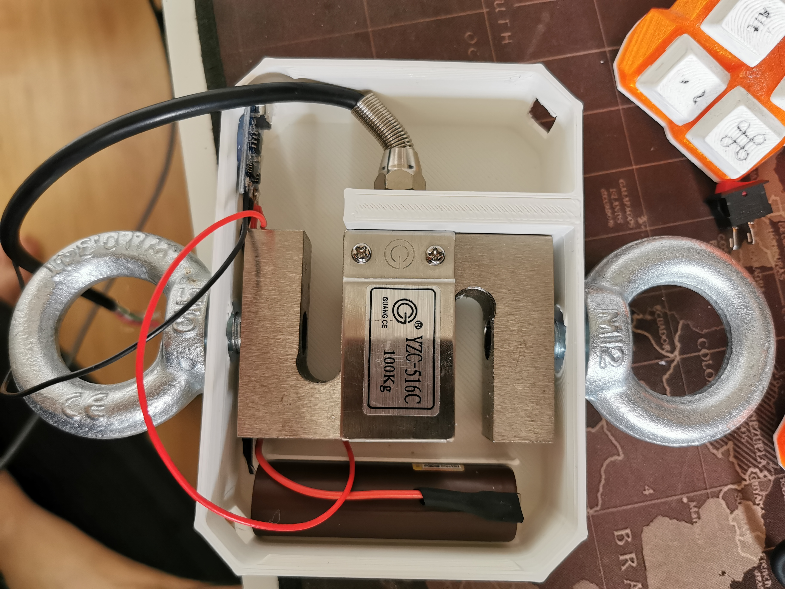
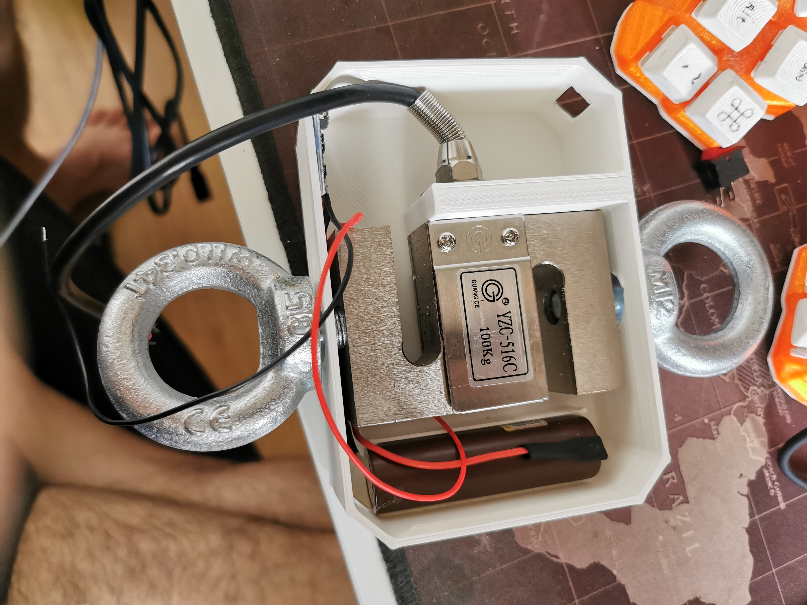
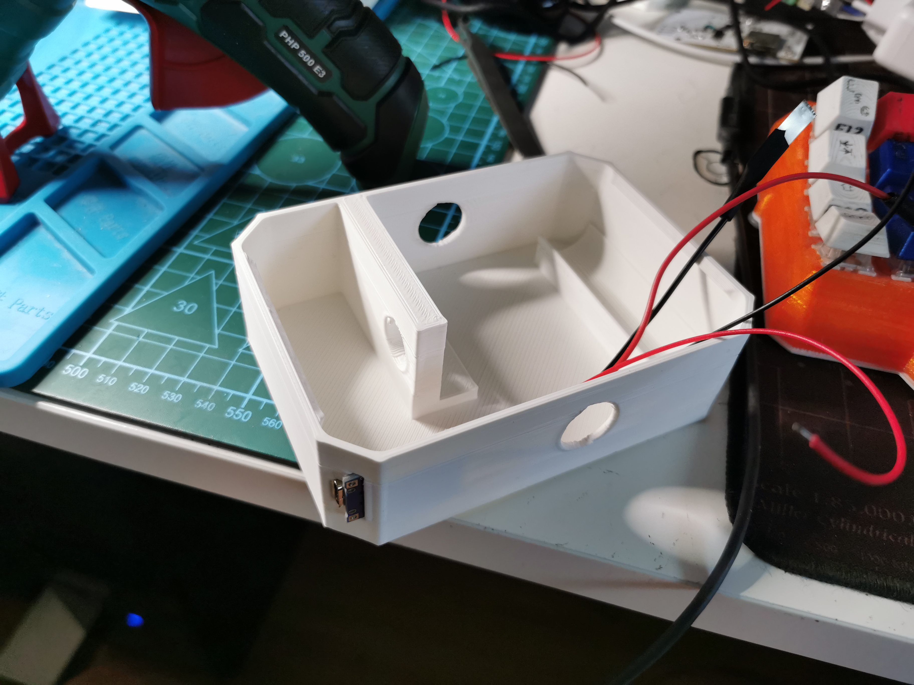
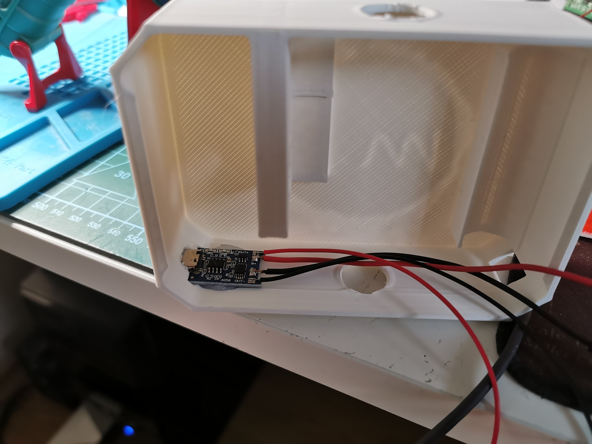

## Mobile application

*TBA*

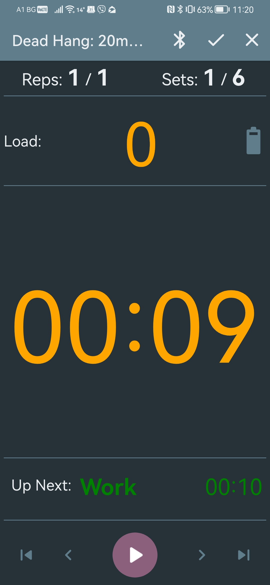
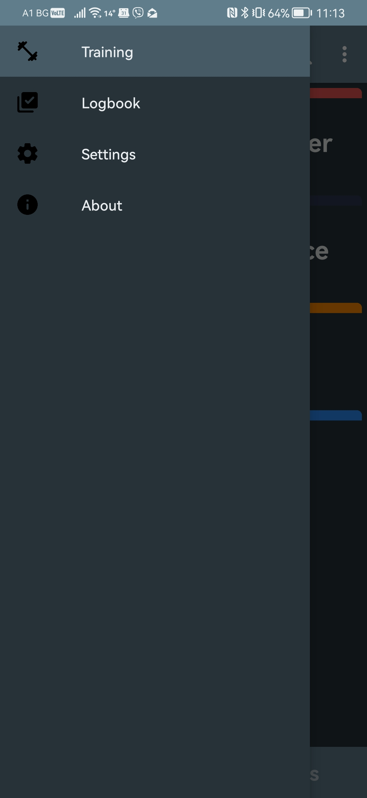
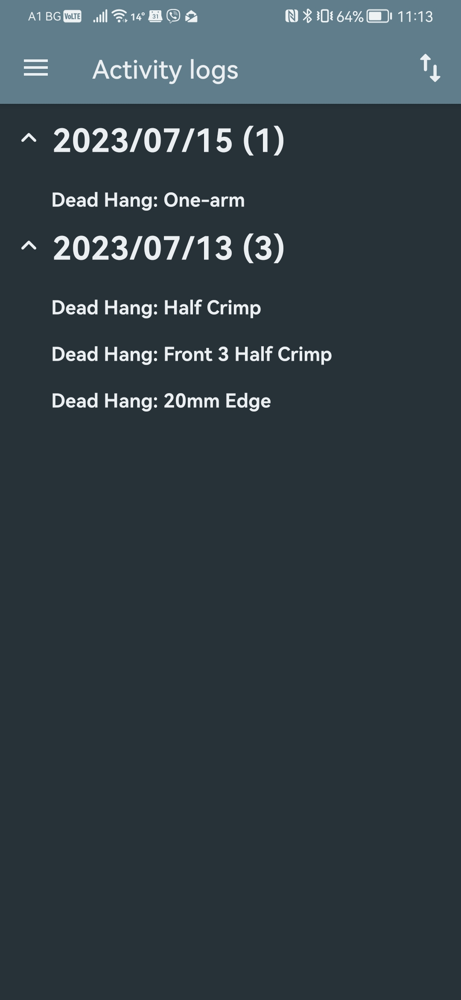
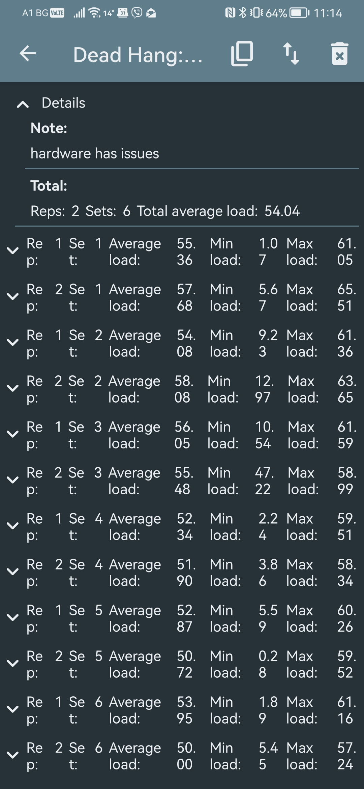
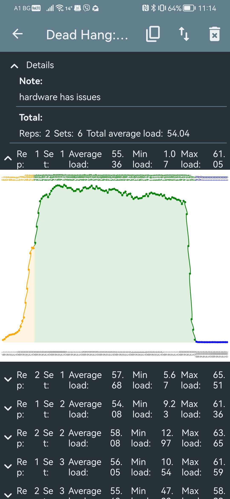